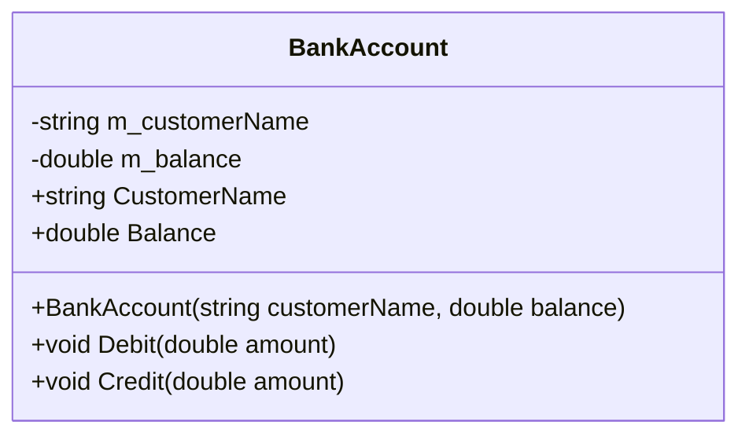

# Diagrama de Clases

## Descripción

La clase `BankAccount` representa una cuenta bancaria básica con las siguientes características:

- **m_customerName**: Nombre del cliente (solo lectura)
- **m_balance**: Saldo de la cuenta
- **Debit()**: Permite realizar retiros validando que el monto sea positivo y no exceda el saldo
- **Credit()**: Permite realizar depósitos validando que el monto sea positivo

